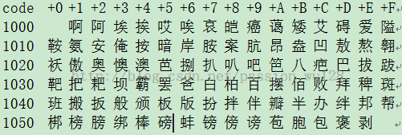
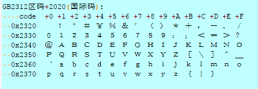
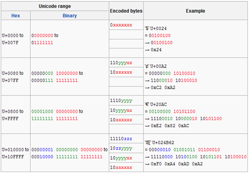
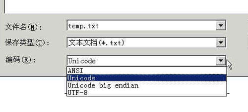

#编码编年史

很久以前，计算机只在美国用，他们把8个bit定为一个字节；1个字节的8bit可以组合出256(2的8次方)种不同的状态。
他们把其中的编号从0开始的32种状态分别规定了特殊的用途，例如遇上00x10, 终端就换行，遇上0x07, 终端就向人们嘟嘟叫。。。
于是就把这些0x20以下的字节状态称为"控制码"。他们又把所有的空格、标点符号、数字、大小写字母分别用连续的字节状态表示，一直编到了第127号，这样计算机就可以用不同字节来存储英语的文字了。大家看到这样，都感觉很好，于是大家都把这个方案叫做 ANSI 的"Ascii"编码；

后来，世界各地都开始用计算机了，很多国家有许多ASCII里没有的字符。
他们决定采用127号之后的空位来表示这些新的字母、符号，还加入了很多画表格时需要用下到的横线、竖线、交叉等形状，一直把序号编到了最后一个状态255。从此之后，再没有新的状态可以用了；
从128到255这一页的字符集被称"扩展字符集"。

等到中国人开始用计算机的时候，已经没有可以利用的字节状态来表示汉字，况且有6000多个常用汉字和几万个生僻/繁体字呢。
我们不客气地把那些127号之后的奇异符号们直接取消掉, 规定：一个小于127的字符的意义与原来相同，但两个大于127的字符连在一起时，就表示一个汉字，前面的一个字节（他称之为高字节）从0xA1用到0xF7，后面一个字节（低字节）从0xA1到0xFE，这样我们就可以组合出大约7000多个简体汉字了。在这些编码里，我们还把数学符号、罗马希腊的字母、日文的假名们都编进去了，
连在 ASCII 里本来就有的数字、标点、字母都统统重新编了两个字节长的编码，这就是常说的"全角"字符，而原来在127号以下的那些就叫"半角"字符了。
中国人民看到这样很不错，于是就把这种汉字方案叫做 "GB2312"。GB2312 是对 ASCII 的中文扩展。

但是中国的汉字太多了，我们很快就就发现有许多人的人名没有办法在这里打出来，特别是某些很会麻烦别人的国家领导人。于是我们不得不继续把 GB2312 没有用到的码位找出来老实不客气地用上。
　　后来还是不够用，于是干脆不再要求低字节一定是127号之后的内码，只要第一个字节是大于127就固定表示这是一个汉字的开始，不管后面跟的是不是扩展字符集里的内容。结果扩展之后的编码方案被称为 GBK 标准，GBK 包括了 GB2312 的所有内容，同时又增加了近20000个新的汉字（包括繁体字）和符号。
　　后来少数民族也要用电脑了，于是我们再扩展，又加了几千个新的少数民族的字，GBK 扩成了 GB18030。从此之后，中华民族的文化就可以在计算机时代中传承了。
　　中国的程序员们看到这一系列汉字编码的标准是好的，于是通称他们叫做 "DBCS"（Double Byte Charecter Set 双字节字符集）。在DBCS系列标准里，最大的特点是两字节长的汉字字符和一字节长的英文字符并存于同一套编码方案里，因此他们写的程序为了支持中文处理，必须要注意字串里的每一个字节的值，如果这个值是大于127的，那么就认为一个双字节字符集里的字符出现了。那时候凡是受过加持，会编程的计算机僧侣们都要每天念下面这个咒语数百遍：
　　"一个汉字算两个英文字符！一个汉字算两个英文字符……"
　　因为当时各个国家都像中国这样搞出一套自己的编码标准，结果互相之间谁也不懂谁的编码，谁也不支持别人的编码，连大陆和台湾这样只相隔了150海里，使用着同一种语言的兄弟地区，也分别采用了不同的 DBCS 编码方案——当时的中国人想让电脑显示汉字，就必须装上一个"汉字系统"，专门用来处理汉字的显示、输入的问题，但是那个台湾的愚昧封建人士写的算命程序就必须加装另一套支持 BIG5 编码的什么"倚天汉字系统"才可以用，装错了字符系统，显示就会乱了套！这怎么办？而且世界民族之林中还有那些一时用不上电脑的穷苦人民，他们的文字又怎么办？
　　真是计算机的巴比伦塔命题啊！
　　正在这时，大天使加百列及时出现了——一个叫 ISO （国际标谁化组织）的国际组织决定着手解决这个问题。他们采用的方法很简单：废了所有的地区性编码方案，重新搞一个包括了地球上所有文化、所有字母和符号的编码！他们打算叫它"Universal Multiple-Octet Coded Character Set"，简称 UCS, 俗称 "UNICODE"。
　　UNICODE 开始制订时，计算机的存储器容量极大地发展了，空间再也不成为问题了。于是 ISO 就直接规定必须用两个字节，也就是16位来统一表示所有的字符，对于ascii里的那些“半角”字符，UNICODE 包持其原编码不变，只是将其长度由原来的8位扩展为16位，而其他文化和语言的字符则全部重新统一编码。由于"半角"英文符号只需要用到低8位，所以其高8位永远是0，因此这种大气的方案在保存英文文本时会多浪费一倍的空间。
　　这时候，从旧社会里走过来的程序员开始发现一个奇怪的现象：他们的strlen函数靠不住了，一个汉字不再是相当于两个字符了，而是一个！是的，从 UNICODE 开始，无论是半角的英文字母，还是全角的汉字，它们都是统一的"一个字符"！同时，也都是统一的"两个字节"，请注意"字符"和"字节"两个术语的不同，“字节”是一个8位的物理存贮单元，而“字符”则是一个文化相关的符号。在UNICODE 中，一个字符就是两个字节。一个汉字算两个英文字符的时代已经快过去了。
　　从前多种字符集存在时，那些做多语言软件的公司遇上过很大麻烦，他们为了在不同的国家销售同一套软件，就不得不在区域化软件时也加持那个双字节字符集咒语，不仅要处处小心不要搞错，还要把软件中的文字在不同的字符集中转来转去。UNICODE 对于他们来说是一个很好的一揽子解决方案，于是从 Windows NT 开始，MS 趁机把它们的操作系统改了一遍，把所有的核心代码都改成了用 UNICODE 方式工作的版本，从这时开始，WINDOWS 系统终于无需要加装各种本土语言系统，就可以显示全世界上所有文化的字符了。
　　但是，UNICODE 在制订时没有考虑与任何一种现有的编码方案保持兼容，这使得 GBK 与UNICODE 在汉字的内码编排上完全是不一样的，没有一种简单的算术方法可以把文本内容从UNICODE编码和另一种编码进行转换，这种转换必须通过查表来进行。
　　如前所述，UNICODE 是用两个字节来表示为一个字符，他总共可以组合出65535不同的字符，这大概已经可以覆盖世界上所有文化的符号。如果还不够也没有关系，ISO已经准备了UCS-4方案，说简单了就是四个字节来表示一个字符，这样我们就可以组合出21亿个不同的字符出来（最高位有其他用途），这大概可以用到银河联邦成立那一天吧！
　　UNICODE 来到时，一起到来的还有计算机网络的兴起，UNICODE 如何在网络上传输也是一个必须考虑的问题，于是面向传输的众多 UTF（UCS Transfer Format）标准出现了，顾名思义，UTF8就是每次8个位传输数据，而UTF16就是每次16个位，只不过为了传输时的可靠性，从UNICODE到UTF时并不是直接的对应，而是要过一些算法和规则来转换。
　　受到过网络编程加持的计算机僧侣们都知道，在网络里传递信息时有一个很重要的问题，就是对于数据高低位的解读方式，一些计算机是采用低位先发送的方法，例如我们PC机采用的 INTEL 架构，而另一些是采用高位先发送的方式，在网络中交换数据时，为了核对双方对于高低位的认识是否是一致的，采用了一种很简便的方法，就是在文本流的开始时向对方发送一个标志符——如果之后的文本是高位在位，那就发送"FEFF"，反之，则发送"FFFE"。不信你可以用二进制方式打开一个UTF-X格式的文件，看看开头两个字节是不是这两个字节？


#字符集：
所谓的字符集，形象一点理解就是某个值与某个中文字的映射，而每个字符集都有自己不同的映射关系
字符集都是人们规定出来的，本身必须通过某些标准发布并且被广泛使用才有意义。

按照字符集来划分：
计算机中的字符分为两大类：ANSI字符集和unicode字符集

按照中国常用的编码来分：
ANSI字符集又分为ASCII编码，GB2312编码，GBK编码等
UNICODE字符集又分为unicode编码，utf8编码，utf8-bom编码，UCS-2 LE,UCS-2BE;

GB2312编码：1981年5月1日发布的简体中文汉字编码国家标准。GB2312对汉字采用双字节编码，收录7445个图形字符，其中包括6763个汉字和682个其它符号。
BIG5编码：台湾地区繁体中文标准字符集，采用双字节编码，共收录13053个中文字，1984年实施。

GBK编码：1995年12月发布的汉字编码国家标准，是对GB2312编码的扩充，对汉字采用双字节编码。命名GBK1.0.
GBK字符集共收录了21886个符号。共收录21003个汉字，(todo:待确定)
包含国家标准GB13000-1中的全部中日韩汉字，和BIG5编码中的所有汉字。
GB18030编码：2000年3月17日发布的汉字编码国家标准，是对GBK编码的扩充，覆盖中文、日文、朝鲜语和中国少数民族文字，其中收录27484个汉字。GB18030字符集采用单字节、双字节和四字节三种方式对字符编码。兼容GBK和GB2312字符集。
Unicode编码：国际标准字符集，它将世界各种语言的每个字符定义一个唯一的编码，以满足跨语言、跨平台的文本信息转换。


字符内码：
字符内码(charcter code)指的是用来代表字符的内码.读者在输入和存储文档时都要使用内码,内码分为
单字节内码 -- Single-Byte character sets (SBCS),可以支持256个字符编码.  
双字节内码 -- Double-Byte character sets)(DBCS),可以支持65000个字符编码.主要用来对大字符集的东方文字进行编码.  


#ASCII
ASCII是American Standard Code for Information Interchange（美国信息交换标准代码）的缩写，而不是ASCⅡ(罗马数字2)，有很多人在这个地方产生误解；

ASCII是由ANSI制定的，ANSI是American National Standard Institute(美国国家标准学会) 的缩写； 

ASCII是标准的单字节字符编码方案，用于基于文本的数据，起始于50年代后期，在1967年定案。
它最初是美国国家标准，之后已被国际标准化组织（International Organization for Standardization, ISO）定为国际标准，称为ISO 646标准。

ASCII编码规则：
标准ASCII 码也叫基础ASCII码，使用7 位二进制数（剩下的1位二进制为0）来表示所有的大写和小写字母，数字0到9、标点符号， 以及在美式英语中使用的特殊控制字符。
0x0-0x7F
0～31及127(共33个)是控制字符或通信专用字符;
32～126(共95个)是字符(32是空格），其中48～57为0到9十个阿拉伯数字。
65～90为26个大写英文字母，
97～122号为26个小写英文字母，
其余为一些标点符号、运算符号等。


后128个称为扩展ASCII码。
许多基于x86的系统都支持使用扩展ASCII。
扩展ASCII 码允许将每个字符的第8 位用于确定附加的128 个特殊符号字符、外来语字母和图形符号。
对扩展的ASCII码，不同的国家有不同的字符集，所以它并不是国际标准。

另外由于扩展ASCII码把最高位也用上了导致这个扩展标准争议很大，没有得到推广，应该以后不会得到推广。因为无论是GBK还是UTF8，如果ASCII字符编码最高位能为1都会造成混乱无法解析。

#GB2312编码：
GB2312或 GB2312-80是中国国家标准简体中文字符集, 全称：《中华人民共和国国家标准信息交换汉字编码字符集》；
又称GB0。是第一个版本的简体中文字符集.
是由中国国家标准总局1980年发布，1981年5月1日开始实施的一套国家标准，标准号是GB2312—1980。
GB就是拼音guobiao的简称。适用于汉字处理、汉字通信等系统之间的信息交换，通行于中国大陆；新加坡等地也采用此编码。
中国大陆几乎所有的中文系统和国际化的软件都支持GB2312。
基本集共收入汉字6763个和非汉字图形字符682个。
其中一级汉字3755个，二级汉字3008个,同时收录包括拉丁字母、希腊字母、日文平假名及片假名字母、俄罗斯语西里尔字母在内的682个全形字符。

但对于人名、古汉语等方面出现的罕用字，GB2312不能处理，这导致了后来GBK及GB18030汉字字符集的出现。
总的来说，是支持字符最少的简体中文字符集。

GB2312编码查询：
http://www.knowsky.com/resource/gb2312tbl.htm
备注：这个表格不是GB2312区位编码，而是内码（GB2312标准码+0xA0A0）；

#### GB2312区位码
GB2312采用双字节编码，对字符集进行了“分区”处理，每区含有94个汉字/符号。这种表示方式也称为区位码。
01-09区为特殊符号。          
10-15保留（自定义符号区）。
16-55区为一级汉字，按拼音排序，同音字按笔画顺序；
56-87区为二级汉字，按偏旁部首、笔画排序。
 88-94保留（自定义汉字区）。
GB2312区位码是从0x0101(第1区第1位)开始计算；
备注：
中文"区位输入法"就是映射这个区位码表的；
区位码查询：http://www.fzrtvu.net/htm/qwm.htm
高考时填报志愿的表格里的姓名一栏后面有个姓名代码，就是区位码；


#### GB2312内码：
把十六进制的区位码加上0x2020，就得到国标码。国标码加上0x8080，就得到常用的计算机机内码。
所以区位码加上0xA0A0就得到了计算机内码。
什么是计算机内码呢，通俗的将就是存储字符时在内存里面的整数。下面举个例子。
汉字“啊”是GB2312字符集中的第一个汉字，它的区位码为0x1001。如下图：


 0x1001加上0xA0A0就是0xB0A1，这就是“啊”的计算机内码。所以下面这段C程序将输出0xB0A1。
char* p = "啊";  
printf("0x%X%X", unsigned char(p[0]), unsigned char(p[1]));  


#### 为什么GB2312区位码要加0x2020得到国标码？
GB2312字符是用双字节存储的，因此这句话可以理解为：
高字节区号+0x20，低字节的位号+0x20；
查询ASCII表得知，0x20之前的是控制符，而从0x20（空格符）之后的ASCII字符（0x20-0x7F），GB2312中全部重新搞了一套相对应全角字符（从GB2312内码的A3A1开始）;
当然：ASCII中的字符是与GB2312中的字符不一样的：
ASCII：abcdefghijklmnopqrstuvwxyz1234567ABCDE
GB2312：ａｂｃｄｅｆｇｈｉｊｋｌｍｎｏｐｑｒｓｔｕｖｗｘｙ１２３４５６７８ＡＢＣＤＥ

我们把这部分ASCII(0x20-0x7F)的GB2312区位码拉出来看看：


然后把这个区位码全部+0x2020之后得到国际码：


把这段国际码与ASCI做对比：


从上面可以看出：
字符"！"的编码为：0x2321,高字节0x23在ASCI中代表字符"#",低字节0x21在ASCII中代表字符"!"
字符"＂"的编码为：0x2322,高字节0x23在ASCI中代表字符"#",低字节0x22在ASCII中代表字符"”"
....

结论是：
ASCII中0x20之后的字符，在GB2312国际码中的低字节是相同的；

#### 全角字符、半角字符：
这里引申出了全角和半角的概念：
通过以上计算，我们看出双字节２(0xA3B2 )是全角的二，ASCII的2(0x32)是半角的二；


#### 为什么GB2312国际码要加0x8080得到计算机内码??
这个把0x8080转换为二进制就比较容易理解了；
0x8080的二进制为：
10000000 10000000
其中bit[7]为1，保证了GB2312字符的高字节和低字节都不会与ASCII产生冲突（ASCII的bit[7]永远是0）
结论：
汉字内码是采用双字节的变形国标码，在每个字节的低7位与国标码相同，每个 字节的最高位为1，以与ASCII码字符编码区别。

#### 符合ANSI标准的文件中：
同一个ANSI文件里，我们既可以输入半角字符（ASCII）又可以输入中文（双/多字节）
那么怎么区分ASCII和中文编码呢？
从ASCII表我们知道标准ASCII只有128个字符，0~127即0x00~0x7F（0111 1111）。所以区分的方法就是，高字节的最高位为0则为ASCII，为1则为中文。

备注:
一般而言，当大家提到GB2312编码的时候，都默认指的的内码（+A0A0之后），因此下文提到GB2312编码时，均默认指内码；

#### GB2312编码规则：
每个汉字及符号以两个字节来表示 。 第一个字节称为“高位字节”，第二个字节称为“低位字节”。
高位字节，使用了0xA1-0xF7(把01-87区的区号加上0xA0)，
低位字节，使用了0xA1-0xFE(把01-94加上0xA0)。
汉字区域，高位为0xB0-0xF7，低位为0xA1-0xFE
特殊符号，高位为0xA1-0xA9，低位为0xA1-0xFE

所以GB2312编码中汉字区码是从B0到F7，位码是从A1到FF.
之所以存储了6763个字符，小于82*94=6768，是因为在区码为D7，位码为FA-FE之间共五个编码没有汉字编码（D7FA、D7FB、D7FC、D7FD、D7FE），
所以GB2312字符集总数：6768-5=6763个。


#GBK
过了几年之后，大家发现GB2312里的字符不够用了；
例如比较生僻的"燊"，或者某国家领导人的“镕”，在GB2312中并没有这些字符；

这时候就产生了GBK（1995）编码：
GBK即汉字内码扩展规范，K为汉语拼音 Kuo Zhan（扩展）中“扩”字的声母
英文全称Chinese Internal Code Specification。

由于GB2312-80只收录6763个汉字，有不少汉字，并未有收录在内。于是厂商微软利用GB2312-80未使用的编码空间，收录GB13000.1-93全部字符制定了GBK编码。根据微软资料，GBK是对GB2312-80的扩展，也就是CP936字码表 (Code Page 936)的扩展（之前CP936和GB2312-80一模一样），最早实现于Windows 95简体中文版。虽然GBK收录GB13000.1-93的全部字符，但编码方式并不相同。原始GB13000一直未被业界采用，后续国家标准GB18030技术上兼容GBK而非GB13000。总的来说，GBK是微软根据GB13000所收录的字符，在GB2312的基础上扩展而来的，但其编码方式和GB13000不一样，而后续的国家标准GB18030事实上兼容GBK而不是GB13000，所以GB13000只是一个未被业界使用的字符集，而GBK才真正成为了标准。


GBK编码表查询：http://www.qqxiuzi.cn/zh/hanzi-gbk-bianma.php
例如：燊 0x9F 0xF6，我们发现这个编码和GB2312不同，比GB2312起始位置0xA0A0还小。
难不成新补充的区位号是负数。。
其实不然，这次的补充只补充了计算机编码表，并没有补充区位码表。也就是说区位码表并没有更新，用区位码打字法还是打不出这些字，而网上的反向区位码表查询也只是按照GBK的编码计算，并不代表字与区位号完全对应。时代的发展，区位码表早已经是进入博物馆的东西了。

Big5是与GB2312同时期的一种台湾地区繁体字的编码格式。后来GBK编码的制定，把Big5用的繁体字也包含进来（但编码不兼容），还增加了一些其它的中文字符。

GBK总体编码范围为0x8140~0xFEFE，首字节在 0x81~0xFE 之间，尾字节在 0x40~0xFE 之间（其中所有位的xx7F未编码）。

微软Windows安排给GBK的code page（代码页）是CP936，所以有时候看到编码格式是CP936，其实就是GBK的意思

备注：
GBK和GB2312的关系有点像百叶窗；镂空状态时是GB2312,全部封住就是GBK；


#GB18030
2000年和2005年，国家又先后两次发布了GB18030编码标准，兼容GBK，新增四字节的编码，但比较少见。
GBK18030编码，共收录了27484个汉字，同时还收录了藏文、蒙文、维吾尔文等主要的少数民族文字，现在WINDOWS平台必需要支持GBK18030编码。

GB18030：全称：国家标准GB18030-2005《信息技术中文编码字符集》，是中华人民共和国现时最新的内码字集，是GB18030-2000《信息技术信息交换用汉字编码字符集基本集的扩充》的修订版。与GB 2312-1980完全兼容，与GBK基本兼容，支持GB13000及Unicode的全部统一汉字，共收录汉字70244个。总的来说，现时最新的中国内码字符集，与GB2312与GBK等都兼容，并且支持Unicode的全部统一汉字。

按照GBK18030、GBK、GB2312的顺序，３种编码是向下兼容，同一个汉字在三个编码方案中是相同的编码。


#UNICODE:
GBK是中国标准，只在中国使用，并没有表示大多数其它国家的编码；而各国又陆续推出各自的编码标准，互不兼容，非常不利于全球化发展。于是后来国际组织发行了一个全球统一编码表，把全球各国文字都统一在一个编码标准里，名为Unicode。
如果把各种文字编码形容为各地的方言，那么Unicode就是世界各国合作开发的一种统一语言。
在这种语言环境下，不会再有语言的编码冲突，在同屏下，可以显示任何语言的内容，这就是Unicode的最大好处。

Unicode的学名是"Universal Multiple-Octet Coded Character Set"。
Unicode依随着通用字符集（Universal Character Set）的标准而发展，简称为UCS。


现在用的是UCS-2，即２个字节编码，而UCS-4是为了防止将来２个字节不够用才开发的。
UCS-2转换到UCS-4只是简单的在前面加２个字节0。

备注：
超过双字节的Unicode目前还没有广泛支持，很多软件容易出bug；
例如cfl的printMessage()如果打印一个三字节的unicode字符就会抛错；

全角和半角：
前面提及GBK有全角半角之分，那么unicode中呢？
Unicode为中国特色的全角英文字符也单独分配了编码，简单粗暴。
比如：
全角的２的Unicode编码是：0xFF12
半角的2 的Unicode编码是：0x0032

codepage:
那么既然统一了编码，如何兼容原先各国的文字编码呢？
这个时候就需要codepage了
什么是codepage？codepage就是各国的文字编码和Unicode之间的映射表。
codepage 指的是一个经过挑选的以特定顺序排列的字符内码列表,对于早期的单字节内码的语种,codepage中的内码顺序使得系统可以按照此列表来根据键盘的输入 值给出一个对应的内码.对于双字节内码,则给出的是MultiByte到Unicode的对应表,这样就可以把以Unicode形式存放的字符转化为相应 的字符内码,或者反之,在Linux核心中对应的函数就是utf8_mbtowc和utf8_wctomb.  

比如简体中文和Unicode的映射表就是CP936

windows下的
cp936映射表：http://www.unicode.org/Public/MAPPINGS/VENDORS/MICSFT/WINDOWS/CP936.TXT

以下是几个常用的codepage，相应的修改上面的地址的数字即可。
codepage=936 简体中文GBK
codepage=950 繁体中文BIG5
codepage=437 美国/加拿大英语
codepage=932 日文
codepage=949 韩文
codepage=866 俄文
codepage=65001 unicode UFT-8 
最后一个65001，据个人理解，应该只是一个虚拟的映射表，实际只是一个算法而已。
从936中随意取一行，例如：
0x9993 0x6ABD #CJK UNIFIED IDEOGRAPH
前面的编码是GBK的编码，后面的是Unicode。
通过查这张表，就能简单的实现GBK和Unicode之间的转换。

补充：
微软也为GB18030定义了code page：CP54936。但是由于GB18030有一部分4字节编码，而Windows的代码页只支持单字节和双字节编码，所以这个code page是无法真正使用的。


更多cpdepage参考资料：
http://blog.csdn.net/normallife/article/details/8548306

备注：
Linux下Codepage的作用
在Linux 下引入对Codepage的支持主要是为了访问FAT/VFAT/FAT32/NTFS/NCPFS等文件系统下的多语种文件名的问题,
目前在NTFS和 FAT32/VFAT下的文件系统上都使用了Unicode,这就需要系统在读取这些文件名时动态将其转换为相应的语言编码.
因此引入了NLS支持.其相 应的程序文件在/usr/src/linux/fs/nls下:
nls_cp936.c  
实现了下列函数:

```C++
    extern int utf8_mbtowc(__u16 *, const __u8 *, int);  
    extern int utf8_mbstowcs(__u16 *, const __u8 *, int);  
    extern int utf8_wctomb(__u8 *, __u16, int);  
    extern int utf8_wcstombs(__u8 *, const __u16 *, int);
```

这样在加载相应的文件系统时就可以用下面的参数来设置Codepage:


#### Unicode的编码方式和实现方式
大概来说，Unicode编码系统可分为编码方式和实现方式两个层次。

编码方式：
统一码的编码方式与ISO 10646的通用字符集概念相对应。目前实际应用的统一码版本对应于UCS-2，使用16位的编码空间。
也就是每个字符占用2个字节。这样理论上一共最多可以表示2的16次方（即65536）个字符。基本满足各种语言的使用。
实际上当前版本的统一码并未完全使用这16位编码，而是保留了大量空间以作为特殊使用或将来扩展。

实现方式：
Unicode的实现方式不同于编码方式。一个字符的Unicode编码是确定的。
但是在实际传输过程中，由于不同系统平台的设计不一定一致，以及出于节省空间的目的，对Unicode编码的实现方式有所不同。Unicode的实现方式称为Unicode转换格式（UnicodeTransformation Format，简称为UTF）。
常见的实现方式有UTF-8、UTF-16等。
所以，总的来说，我们常用到的UTF与Unicode的关系是，
UTF是Unicode编码方式的实现方式。
Unicode字符集本身只是一个编码与字符的对应关系表而已，
而出于节省空间等的目的，有了UTF-8等实现方式。

#### unicode的存储
Unicode 只是一个符号集，它只规定了符号的二进制代码，却没有规定这个二进制代码应该如何存储。
我们已经知道，英文字母只用一个字节表示就够了，如果 Unicode 统一规定，每个符号用三个或四个字节表示，那么每个英文字母前都必然有二到三个字节是0，这对于存储来说是极大的浪费，文本文件的大小会因此大出二三倍，这是无法接受的。
它们造成的结果是：
1）出现了 Unicode 的多种存储方式，也就是说有许多种不同的二进制格式，可以用来表示 Unicode。
2）Unicode 在很长一段时间内无法推广，直到互联网的出现。

互联网的普及，强烈要求出现一种统一的编码方式。
UTF-8 就是在互联网上使用最广的一种 Unicode 的实现方式。
其他实现方式还包括 UTF-16（字符用两个字节或四个字节表示）和 UTF-32（字符用四个字节表示），不过在互联网上基本不用。

#### BOM
有一个问题：计算机怎么知道某一个UCS-2文件到底采用哪一种方式编码？
Unicode 规范定义，每一个文件的最前面分别加入一个表示编码顺序的字符，这个字符的名字叫做"零宽度非换行空格"（zero width no-break space），用FEFF表示。这正好是两个字节，而且FF比FE大1。
如果一个文本文件的头两个字节是FE FF，就表示该文件采用大端方式（对应记事本的Unicode big endian）；
如果一个文本文件的头两个字节是FF FE，就表示该文件采用小端方式(对应记事本的Unicode)。
如果一个文本文件的头三个字节是EFBBBF表示该文件是UTF-8编码方式存储。

UTF8-BOM
如何区分一个文本是无BOM的UTF8还是GBK
只能按大量的编码分析来区分。目前识别准确率很高的有：Notepad++等一些常用的IDE，PHP的mb_系列函数，python的chardet库及其它语言衍生版如jchardet，jschardet 等（请自行github）。
那么这些库是怎么区分这些编码的呢？那就是词库，你会看到库的源码里有大量的数组，其实就是对应一个编码里的常见词组编码组合。同样的文件字节流在一个词组库里的匹配程度越高，就越有可能是该编码，判断的准确率就越大。而文件中的中文越少越零散，判断的准确率就越低。

备注：
分析失败的案例：
联通。。。


#### unicode和UCS的关系:
Unicode:
unicode.org制定的编码机制, 要将全世界常用文字都函括进去.
在1.0中是16位编码, 由U+0000到U+FFFF. 每个2byte码对应一个字符; 
在2.0开始抛弃了16位限制, 原来的16位作为基本位平面, 另外增加了16个位平面, 相当于20位编码, 编码范围0到0x10FFFF.

UCS:
ISO制定的ISO10646标准所定义的 Universal Character Set, 采用4byte编码.

Unicode与UCS的关系:
ISO 与unicode.org是两个不同的组织, 因此最初制定了不同的标准; 
但自从unicode2.0开始, unicode采用了与ISO 10646-1相同的字库和字码,
 ISO也承诺ISO10646将不会给超出0x10FFFF的UCS-4编码赋值, 使得两者保持一致.
UCS的编码方式:

 UCS-2, 与unicode的2byte编码基本一样.
 UCS-4, 4byte编码, 目前是在UCS-2前加上2个全零的byte.


#### USC:
UCS有两种格式：UCS-2和UCS-4。
顾名思义，UCS-2就是用两个字节编码，UCS-4就是用4个字节（实际上只用了31位，最高位必须为0）编码.
UCS-2有2^16=65536个码位，UCS-4有2^31=2147483648个码位。

#### Unicode 之 BMP  
Basic Multilingual Plane, 简称BMP（基本多文种平面），或称第零平面（Plane 0），是Unicode中的一个编码区段。
编码从U+0000至U+FFFF。

#### 什么是 UCS 和 ISO 10646?
国际标准 ISO 10646 定义了 通用字符集 (Universal Character Set, UCS). UCS 是所有其他字符集标准的一个超集. 它保证与其他字符集是双向兼容的. 就是说, 如果你将任何文本字符串翻译到 UCS格式, 然后再翻译回原编码, 你不会丢失任何信息.
ISO 10646 定义了一个 31 位的字符集. 然而, 在这巨大的编码空间中, 迄今为止只分配了前 65534 个码位 (0x0000 到 0xFFFD). 这个 UCS 的 16位子集称为 基本多语言面 (Basic Multilingual Plane, BMP). 将被编码在 16 位 BMP 以外的字符都属于非常特殊的字符(比如象形文字), 且只有专家在历史和科学领域里才会用到它们. 按当前的计划, 将来也许再也不会有字符被分配到从 0x000000 到 0x10FFFF 这个覆盖了超过 100 万个潜在的未来字符的 21 位的编码空间以外去了. ISO 10646-1 标准第一次发表于 1993 年, 定义了字符集与 BMP 中内容的架构. 定义 BMP 以外的字符编码的第二部分 ISO 10646-2 正在准备中, 但也许要过好几年才能完成. 新的字符仍源源不断地加入到 BMP 中, 但已经存在的字符是稳定的且不会再改变了.


#UCS-2
UCS-2就是原始的双字节Unicode编码，用二进制编辑器打开UCS-2大端模式的文本文件，从左往右看，看到的就是每个字符的Unicode编码了
至于什么是大端小端，就是字节的存放顺序不同。
第一个字节在前，就是"大端方式"（Big endian），第二个字节在前就是"小端方式"（Little endian）。

UCS-2 格式可以存储 Unicode 码（码点不超过0xFFFF）。以汉字严为例，Unicode 码是4E25，需要用两个字节存储，一个字节是4E，另一个字节是25。存储的时候，4E在前，25在后，这就是 Big endian 方式；25在前，4E在后，这是 Little endian 方式。

///todo:以爱数为例。。


UTF8
因为英文字符也全部使用双字节，存储成本和流量会大大地增加，所以Unicode编码大多数情况并没有被原始地使用，而是被转换编码成UTF8。下表就是其转换公式：


#### utf8的编码规则：
1）对于单字节的符号，字节的第一位设为0，后面7位为这个符号的 Unicode 码。因此对于英语字母，UTF-8 编码和 ASCII 码是相同的。
2）对于n字节的符号（n > 1），第一个字节的前n位都设为1，第n + 1位设为0，后面字节的前两位一律设为10。剩下的没有提及的二进制位，全部为这个符号的 Unicode 码。(填充时从二进制低位开始，依次向高位填充，多出的位补0）

例：
"你"的Unicode编码：4F 60　　　　　　　　　　01001111 01100000
"你"字的UTF-8编码：E4 BD A0　　　　　　　　11100100 10111101 10100000

UTF-8的最前面３个1，表示整个UTF-8串是由３个字节构成的。
经过UTF-8编码之后，再也不会出现敏感字符了，因为最高位始终为1。

以下是Unicode和UTF-8之间的转换关系表：
U-0x00000000 - U-0x0000007F:     0xxxxxxx
U-0x00000080 - U-0x000007FF:     110xxxxx 10xxxxxx
U-0x00000800 - U-0x0000FFFF:      1110xxxx 10xxxxxx 10xxxxxx
U-0x00010000 - U-0x001FFFFF:      11110xxx 10xxxxxx 10xxxxxx 10xxxxxx
U-0x00200000 - U-0x03FFFFFF:      111110xx 10xxxxxx 10xxxxxx 10xxxxxx 10xxxxxx
U-0x04000000 - U-0x7FFFFFFF:      1111110x 10xxxxxx 10xxxxxx 10xxxxxx 10xxxxxx 10xxxxxx
Unicode编码转换到UTF-8,简单的把Unicode字节流套到x中就变成UTF-8了。


#### utf7：
UTF-7是一种可变长度字元编码方式，用以将 Unicode 字元以 ASCII 编码的字元串来呈现，可以应用在电子邮件传输之类的应用。
严格来说 UTF-7 不能算是 Unicode 所定义的字元集之一，
较精确的来说， UTF-7 是提供了一种将 Unicode 转换为 7 位元 US-ASCII 字元的转换方式。

有兴趣的可以参考：
http://blog.csdn.net/hanford/article/details/53364021
这个比较冷门，此处不做介绍；


#### windows记事本默认存储格式介绍：
打开文件后，点击文件菜单中的另存为命令，会跳出一个对话框，在最底部有一个编码的下拉条。


里面有四个选项：ANSI，Unicode，Unicode big endian和UTF-8。
1）ANSI是默认的编码方式。对于英文文件是ASCII编码，对于简体中文文件是GBK编码。
2）Unicode编码这里指的是 UCS-2 编码方式，即直接用两个字节存入字符的 Unicode 码，这个选项用的 little endian 格式。
3）Unicode big endian编码与上一个选项相对应。
4）UTF-8编码，也就是上一节谈到的编码方法。
选择完"编码方式"后，点击"保存"按钮，文件的编码方式就立刻转换好了。

///todo:示例
windows记事本的ANSI：GB2312编码采用大端存储；
windows记事本的unicode：采用小端方式存储；
windows记事本的unicode big ending: 采用大端方式存储；
windows记事本的utf-8：采用大端；


#### todo:
    大纲：
    1、知识介绍
    2、String str(char* x)和String str(toCFLString(string(char*x)))的区别
    3、windows和linux区别
    4、sqlserver实例，为何要加n'中文'
    5、StreamWriter默认ansi保存？

    基础概念汇总:

    常用编码：
    ANSI,在中国大陆即为GBK（以前是GB2312）;
    UTF8,
    UTF8-BOM
    UCS-2 BE
    UCS-2 LE

    调试时候为何容易看到"烫烫烫烫烫烫烫烫烫烫烫烫烫烫烫"？
    烫的GB2312编码是CCCC

    代码页：


    xshell连接linux虚拟机时候中文乱码：

    保存中文的话，utf8比GBK要更多字节；


