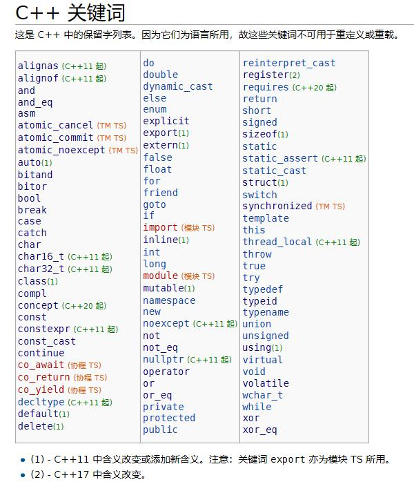
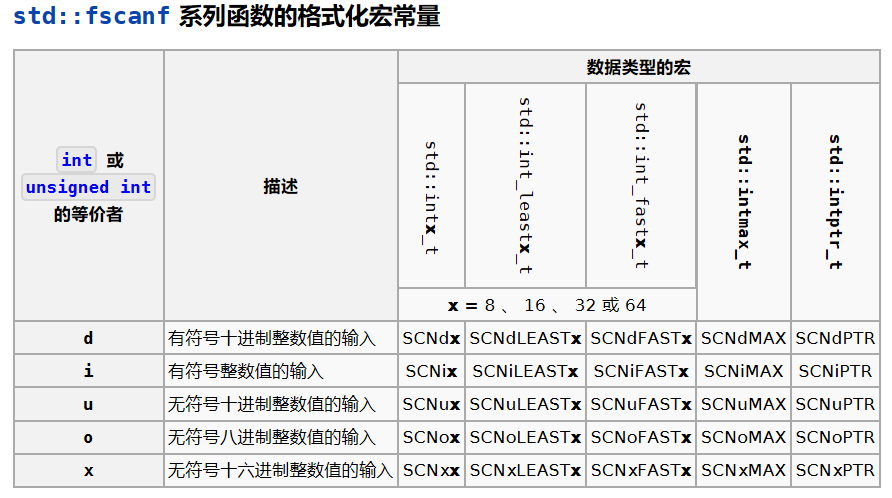
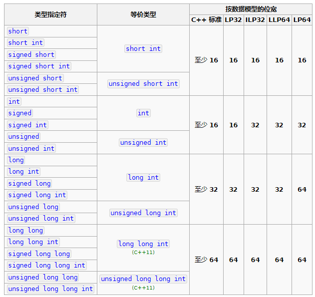
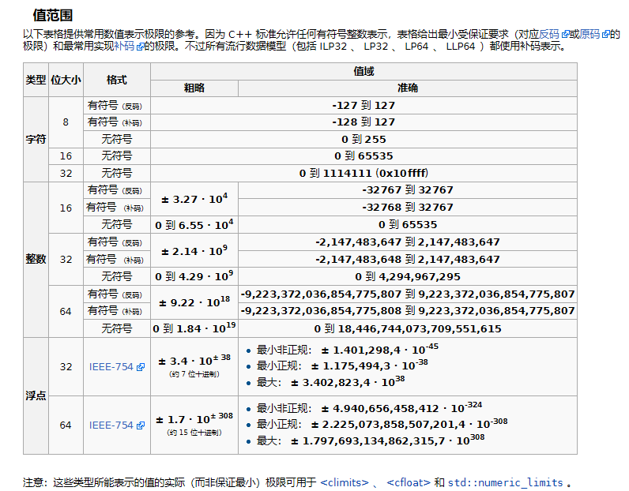
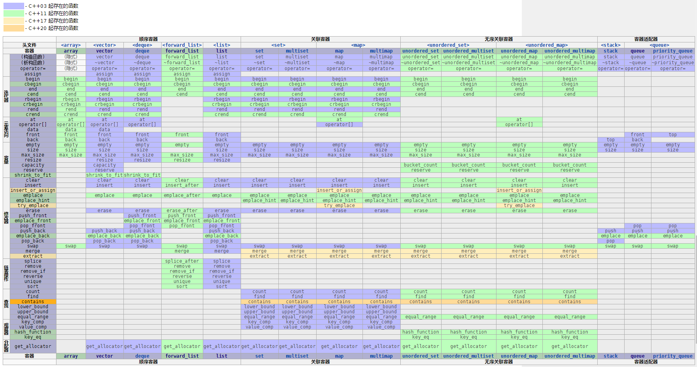
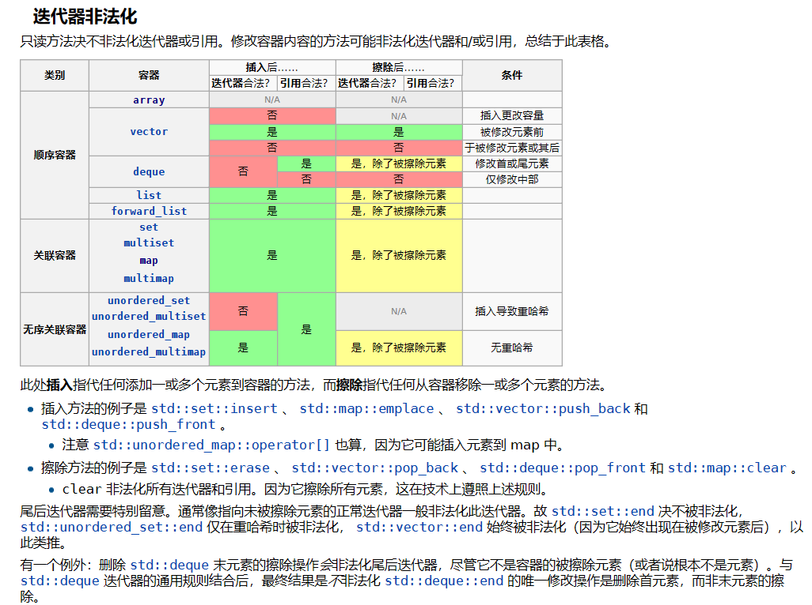
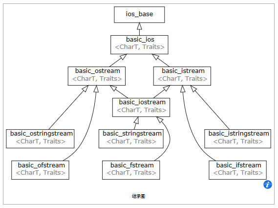

# cppreference
转载请注明出处: https://unihykes.github.io/mark/src/use_std/readme.html

## C++编译器支持
[C++ 编译器支持情况表](https://zh.cppreference.com/w/cpp/compiler_support)

## C++ 语言
[C++语言参考手册](https://zh.cppreference.com/w/cpp/language)
###### 备注:
C++关键字:


## C++ 标准库头文件
[C++标准库头文件](https://zh.cppreference.com/w/cpp/header)
```c++
//工具库
    //工具
    #include <cstdlib> //通用工具：程序控制、动态内存分配、随机数、排序与查找 
    #include <csignal> //信号管理的函数与宏常量
    #include <csetjmp> //保存到执行环境的宏，及跳到执行环境的函数 
    #include <cstdarg> //变长参数列表的处理 
    #include <typeinfo> //运行时类型信息工具 
    #include <typeindex> (C++11 起) //std::type_index
    #include <type_traits> (C++11 起) //编译时类型信息 
    #include <bitset> //std::bitset 类模板 
    #include <functional> //函数对象、函数调用、绑定操作、引用包装 
    #include <utility> //多种工具组件 
    #include <ctime> //C 风格时间/日期工具 
    #include <chrono> (C++11 起) //C++ 时间工具 
    #include <cstddef> //标准宏和类型定义 
    #include <initializer_list> (C++11 起) //std::initializer_list 类模板 
    #include <tuple> (C++11 起) //std::tuple 类模板 
    #include <any> (C++17 起) //std::any 类 
    #include <optional> (C++17 起) //std::optional 类模板 
    #include <variant> (C++17 起) //std::variant 类模板 
    #include <compare> (C++20 起) //三路比较运算符支持 
    #include <version> (C++20 起) //提供依赖实现的库信息 

    //动态内存管理 
    #include <new> //低层内存管理工具 
    #include <memory> //高层内存管理工具 
    #include <scoped_allocator> (C++11 起) //嵌套分配器类 
    #include <memory_resource> (C++17 起) //多态分配器及内存资源 
    
    //数值极限 
    #include <climits> //整数类型极限 
    #include <cfloat> //浮点类型极限 
    #include <cstdint> (C++11 起) //定长整数及其他类型的极限 
    #include <cinttypes> (C++11 起) //格式化宏、 intmax_t 及 uintmax_t 数学工具及转换 
    #include <limits>//查询算术类型属性的标准化方式 

    //错误处理
    #include <exception> //异常处理工具 
    #include <stdexcept> //标准异常对象 
    #include <cassert> //将其参数与零比较的条件性编译宏 
    #include <system_error> (C++11 起) //定义std::error_code，平台依赖的错误码 
    #include <cerrno> //含有最近一次错误号的宏 

//字符串库
#include <cctype> //确定字符数据中所含类型的函数 
#include <cwctype> //确定宽字符数据中所含类型的函数 
#include <cstring> //多种窄字符串处理函数 
#include <cwchar> //多种宽及多字节字符串处理函数 
#include <cuchar> (C++11 起) //C 风格 Unicode 字符转换函数 
#include <string> //std::basic_string 类模板 
#include <string_view> (C++17 起) //std::basic_string_view 类模板 
#include <charconv> (C++17 起) //std::to_chars 与 std::from_chars 

//容器库
#include <array> (C++11 起) //std::array 容器 
#include <vector> //std::vector 容器 
#include <deque> //std::deque 容器 
#include <list> //std::list 容器 
#include <forward_list> (C++11 起) //std::forward_list 容器 
#include <set> //std::set 及 std::multiset 关联容器 
#include <map> //std::map 及 std::multimap 关联容器 
#include <unordered_set> (C++11 起) //std::unordered_set 及 std::unordered_multiset 无序关联容器 
#include <unordered_map> (C++11 起) //std::unordered_map 及 std::unordered_multimap 无序关联容器 
#include <stack> //std::stack 容器适配器 
#include <queue> //std::queue 及 std::priority_queue 容器适配器 
#include <span> (C++20 起) //std::span 视图 

//迭代器库
#include <iterator> //容器迭代器 

//算法库
#include <algorithm> //操作于容器上的算法 
#include <execution> (C++17) //算法并行版本的预定义执行策略 

//数值库
#include <cmath> //常用数学函数 
#include <complex> //复数类型 
#include <valarray> //表示和操作值的数组的类 
#include <random> (C++11 起) //随机数生成器及分布 
#include <numeric> //容器中值的数值运算 
#include <ratio> (C++11 起) //编译时有理数算术 
#include <cfenv> (C++11 起) //浮点环境访问函数 

//输入/输出库
#include <iosfwd> //所有输入/输出库中的类的前置声明 
#include <ios> //std::ios_base 类、std::basic_ios 类模板及数个 typedef 
#include <istream> //std::basic_istream 类模板及数个 typedef 
#include <ostream> //std::basic_ostream 、 std::basic_iostream 类模板及数个typedef 
#include <iostream> //数个标准流对象 
#include <fstream> //std::basic_fstream 、 std::basic_ifstream 、 std::basic_ofstream 类模板及数个typedef 
#include <sstream> //std::basic_stringstream 、 std::basic_istringstream 、 std::basic_ostringstream 类模板及数个 typedef 
#include <syncstream> (C++20 起) //std::basic_osyncstream 、 std::basic_syncbuf 及 typedef 
#include <strstream> (弃用) //std::strstream 、 std::istrstream 、 std::ostrstream 
#include <iomanip> //控制输入输出格式的帮助函数 
#include <streambuf> //std::basic_streambuf 类模板 
#include <cstdio> //C 风格输入输出函数 

//本地化库
#include <locale> //本地化工具 
#include <clocale> //C 本地化工具 
#include <codecvt> (C++11 起)(C++17 中弃用) //Unicode 转换设施 

//正则表达式库
#include <regex> (C++11 起) //支持正则表达式处理的类、算法及迭代器 

//原子操作库
#include <atomic> (C++11 起) //原子操作库 

//线程支持库
#include <thread> (C++11 起) //std::thread 类及支持函数 
#include <mutex> (C++11 起) //互斥原语 
#include <shared_mutex> (C++14 起) //共享的互斥原语 
#include <future> (C++11 起) //异步计算的原语 
#include <condition_variable> (C++11 起) //线程等待条件 

//文件系统库
#include <filesystem> (C++17 起) //std::path 类及支持函数 
```

 

## C++标准库概览
```plantuml
@startmindmap

* std
	* 工具库
		*_ 语言支持库
			*_ 类型支持
				*_ 基本类型
				*_ 数值极限
				*_ 运行时类型识别
				*_ type_traits类型特性(C++11 起)
				
			*_ 动态内存管理
			*_ 错误处理
			*_ initializer_list
			*_ 变参数函数
		*_ 通用库
	* 字符串库
		*_ std::basic_string
		*_ std::basic_string_view(C++17)
		*_ 空终止字符串
		*_ std::char_traits
	* 容器库
		*_ 顺序容器
		*_ 关联容器
		*_ 无序关联容器
		*_ 容器适配器
	* 迭代器库
		*_ 迭代器分类
		*_ 迭代器原语
		*_ 迭代器适配器
		*_ 流迭代器
		*_ 迭代器操作
		*_ 范围访问
		*_ 容器访问
	* 算法库
		*_ 不修改序列的操作
		*_ 修改序列的操作 
		*_ 划分操作  
		*_ 排序操作 
		*_ 二分搜索操作（在已排序范围上） 
		*_ 集合操作（在已排序范围上） 
		*_ 堆操作
		*_ 最小&&最大操作 
		*_ 比较操作 
		*_ 排列操作 
		*_ 数值运算 
		*_ 未初始化内存上的操作 
		*_ C 库 
	* 数值库
	
	left side
	* IO库
		*_ 基于流的 I/O
		*_ C 风格 IO
	* 本地化库
		*_ 国际化
	* 正则表达式库
	* 原子操作库
	* 线程支持库
	* 文件系统库
@endmindmap
```

***
### /工具库/语言支持库/类型支持/基本类型

```plantuml
@startuml
skinparam packageStyle rect

object 附加性基本类型及宏_ {
    size_t
    ptrdiff_t
    nullptr_t(C++11)
    NULL
    max_align_t(C++11)
    offsetof
    byte(C++17) 
    __bool_true_false_are_defined(C++11)
    __alignas_is_defined(C++11)
}

object 定宽整数类型_{
    int8_t
    int16_t
    int32_t
    int64_t
    int_fast8_t
    int_fast16_t
    int_fast32_t
    int_fast64_t
    int_least8_t
    int_least16_t
    int_least32_t
    int_least64_t
    intmax_t
    intptr_t
    uint8_t
    uint16_t
    uint32_t
    uint64_t
    uint_fast8_t
    uint_fast16_t
    uint_fast32_t
    uint_fast64_t
    uint_least8_t
    uint_least16_t
    uint_least32_t
    uint_least64_t
    uintmax_t
    uintptr_t
}

object 有符号整数_最小值{
	INT8_MIN
	INT16_MIN
	INT32_MIN
	INT64_MIN
	INT_FAST8_MIN
	INT_FAST16_MIN
	INT_FAST32_MIN
	INT_FAST64_MIN
	INT_LEAST8_MIN
	INT_LEAST16_MIN
	INT_LEAST32_MIN
	INT_LEAST64_MIN
	INTPTR_MIN
	INTMAX_MIN
}

object 有符号整数_最大值 {
	INT8_MAX
	INT16_MAX
	INT32_MAX
	INT64_MAX
	INT_FAST8_MAX
	INT_FAST16_MAX
	INT_FAST32_MAX
	INT_FAST64_MAX
	INT_LEAST8_MAX
	INT_LEAST16_MAX
	INT_LEAST32_MAX
	INT_LEAST64_MAX
	INTPTR_MAX
	INTMAX_MAX
}

object 无符号整数_最大值{
	UINT8_MAX
	UINT16_MAX
	UINT32_MAX
	UINT64_MAX
	UINT_FAST8_MAX
	UINT_FAST16_MAX
	UINT_FAST32_MAX
	UINT_FAST64_MAX
	UINT_LEAST8_MAX
	UINT_LEAST16_MAX
	UINT_LEAST32_MAX
	UINT_LEAST64_MAX
	UINTPTR_MAX
	UINTMAX_MAX
}

object 函数宏_{
    INT8_C
    INT16_C
    INT32_C
    INT64_C
    INTMAX_C
    UINT8_C
    UINT16_C
    UINT32_C
    UINT64_C
    UINTMAX_C
}
package 基本类型{
    object 语言定义的基础类型{
        void,bool,int 等
    }
    object 附加性基本类型及宏
    附加性基本类型及宏 ..>附加性基本类型及宏_
    
    package "定宽整数(C++11 起)"{
	    object  定宽整数类型
	    定宽整数类型..>定宽整数类型_
	    
	    object  宏常量
	    宏常量..>有符号整数_最小值
	    宏常量..>有符号整数_最大值
	    宏常量..>无符号整数_最大值
	    
	    object 函数宏
	    函数宏..>函数宏_
	    
	    object 格式化宏常量 {
	        详见备注
	    }
	}
}
@enduml
```
###### 备注:
定宽整数/格式化宏常量:


整型位宽

***
### /工具库/语言支持库/类型支持/数值极限

```plantuml
@startuml
skinparam packageStyle rect

object numeric_limits定义{
    template< class T > class numeric_limits;
    template<> class numeric_limits<bool>;
    template<> class numeric_limits<char>;
    template<> class numeric_limits<signed char>;
    template<> class numeric_limits<unsigned char>;
    template<> class numeric_limits<wchar_t>;
    template<> class numeric_limits<char16_t>;   // C++11 特性
    template<> class numeric_limits<char32_t>;   // C++11 特性
    template<> class numeric_limits<short>;
    template<> class numeric_limits<unsigned short>;
    template<> class numeric_limits<int>;
    template<> class numeric_limits<unsigned int>;
    template<> class numeric_limits<long>;
    template<> class numeric_limits<unsigned long>;
    template<> class numeric_limits<long long>;
    template<> class numeric_limits<unsigned long long>;
    template<> class numeric_limits<float>;
    template<> class numeric_limits<double>;
    template<> class numeric_limits<long double>;
}
class numeric_limits{
--成员函数--
	min[静态]
	lowest[静态] (C++11)
	max[静态]
	epsilon[静态]
	round_error[静态]
	infinity[静态]
	quiet_NaN[静态]
	signaling_NaN[静态]
	denorm_min[静态]
    
--成员常量--
	is_specialized[静态 
	is_signed[静态]
	is_integer[静态]
	is_exact[静态]
	has_infinity[静态]
	has_quiet_NaN[静态]
	has_signaling_NaN[静态]
	has_denorm[静态]
	has_denorm_loss[静态]
	round_style[静态]
	is_iec559[静态]
	is_bounded[静态]
	is_modulo[静态]
	digits[静态]
	digits10[静态]
	max_digits10[静态] (C++11)
	radix[静态]
	min_exponent[静态]
	min_exponent10[静态]
	max_exponent[静态]
	max_exponent10[静态]
	traps[静态]
	tinyness_before[静态]
}

object stdint{
	PTRDIFF_MIN(C++11)
	PTRDIFF_MAX(C++11)
	SIZE_MAX(C++11)
	SIG_ATOMIC_MIN(C++11)
	SIG_ATOMIC_MAX(C++11)
	WCHAR_MIN(C++11)
	WCHAR_MAX(C++11)
	WINT_MIN(C++11)
	WINT_MAX(C++11)
}

object 整数类型极限{
	CHAR_BIT
	MB_LEN_MAX
	CHAR_MIN
	CHAR_MAX
	SCHAR_MIN
	SHRT_MIN
	INT_MIN
	LONG_MIN
	LLONG_MIN(C++11)
	SCHAR_MAX
	SHRT_MAX
	INT_MAX
	LONG_MAX
	LLONG_MAX(C++11)
	UCHAR_MAX
	USHRT_MAX
	UINT_MAX
	ULONG_MAX
	ULLONG_MAX(C++11)
}

object 浮点类型极限{
    //todo
}

package 数值极限{
    class std::numeric_limits{
    }
    numeric_limits定义..numeric_limits
    std::numeric_limits..>numeric_limits
    
    object C数值极限接口
    C数值极限接口..>stdint
    C数值极限接口..>整数类型极限
    C数值极限接口..>浮点类型极限
}
@enduml
```
###### 备注:
numeric_limits与C库宏常量的关系

数值取值范围


***
### /工具库/语言支持库/类型支持/运行时类型识别

```plantuml
@startuml
skinparam packageStyle rect
object type_info{
}
object bad_typeid{
}
object bad_cast{
}
object type_index {
}
package 运行时类型识别{}
运行时类型识别..>type_info
运行时类型识别..>bad_typeid
运行时类型识别..>bad_cast
运行时类型识别..>type_index

@enduml
```

***
### /工具库/语言支持库/类型支持/type_traits类型特性(C++11 起)

```plantuml
@startuml
skinparam packageStyle rect

object 基础类型类别{
	is_void(C++11)
	is_null_pointer(C++14)
	is_integral(C++11)
	is_floating_point(C++11)
	is_array(C++11)
	is_enum(C++11)
	is_union(C++11)
	is_class(C++11)
	is_function(C++11)
	is_pointer(C++11)
    is_lvalue_reference(C++11)
	is_rvalue_reference(C++11)
	is_member_object_pointer(C++11)
	is_member_function_pointer(C++11)
}

object 复合类型类别{
	is_fundamental(C++11)
	is_arithmetic(C++11)
	is_scalar(C++11)
	is_object(C++11)
	is_compound(C++11)
	is_reference(C++11)
	is_member_pointer(C++11)
}

object 类型属性{
	is_const(C++11)
	is_volatile(C++11)
	is_trivial(C++11)
	is_trivially_copyable(C++11)
	is_standard_layout(C++11)
	is_pod(C++11)(C++20 中弃用)
	is_literal_type(C++11)(C++17 中弃用)
	has_unique_object_representations(C++17)
	is_empty(C++11)
	is_polymorphic(C++11)
	is_abstract(C++11)
	is_final(C++14)
	is_aggregate(C++17)
	is_signed(C++11)
	is_unsigned(C++11)
}

object 受支持操作{ 
	is_constructible(C++11)
	is_trivially_constructible(C++11)
	is_nothrow_constructible(C++11)
	is_default_constructible(C++11)
	is_trivially_default_constructible(C++11)
	is_nothrow_default_constructible(C++11)
	is_copy_constructible(C++11) 
	is_trivially_copy_constructible(C++11)
	is_nothrow_copy_constructible(C++11)
	is_move_constructible(C++11) 
	is_trivially_move_constructible(C++11)
	is_nothrow_move_constructible(C++11)
	is_assignable(C++11) 
	is_trivially_assignable(C++11)
	is_nothrow_assignable(C++11)
	is_copy_assignable(C++11) 
	is_trivially_copy_assignable(C++11)
	is_nothrow_copy_assignable(C++11)
	is_move_assignable(C++11) 
	is_trivially_move_assignable(C++11)
	is_nothrow_move_assignable(C++11)
	is_destructible(C++11) 
	is_trivially_destructible(C++11)
	is_nothrow_destructible(C++11)
	has_virtual_destructor(C++11) 
	is_swappable_with(C++17)
	is_swappable(C++17)
	is_nothrow_swappable_with(C++17)
	is_nothrow_swappable(C++17)
}

object 属性查询{
	alignment_of(C++11)
	rank(C++11)
	extent(C++11)
}

object 类型关系{ 
	is_same(C++11)
	is_base_of(C++11)
	is_convertible(C++11)
	is_invocable
	is_invocable_r
	is_nothrow_invocable
	is_nothrow_invocable_r(C++17)
}

object 常易变性指定器{
	remove_cv  (C++11)
	remove_const (C++11)
	remove_volatile (C++11)
	add_cv (C++11)
	add_const (C++11)
	add_volatile (C++11)
}
object 引用 {
	remove_reference(C++11)
	add_lvalue_reference(C++11)
	add_rvalue_reference(C++11)
}
object 指针 {
	remove_pointer(C++11)
	add_pointer(C++11)
}
object 符号修改器 {
	make_signed(C++11)
	make_unsigned(C++11)
}
object 数组 {
	remove_extent(C++11)
	remove_all_extents(C++11)
}

storage type_traits #CCDDDD{
}

package type_traits类型属性{
}
基础类型类别<..type_traits类型属性
复合类型类别<..type_traits类型属性
类型属性<..type_traits类型属性
受支持操作<..type_traits类型属性
属性查询<..type_traits类型属性
类型关系<..type_traits类型属性

package 类型修改{
}
类型修改..>常易变性指定器
类型修改..>引用
类型修改..>指针
类型修改..>符号修改器
类型修改..>数组


object 杂项变换{
	aligned_storage(C++11)
	aligned_union(C++11)
	decay(C++11)
	remove_cvref(C++20)
	enable_if(C++11) 
	conditional(C++11) 
	common_type(C++11)
	underlying_type(C++11)
	result_of (C++11) (C++17 中弃用)
	invoke_result (C++17)
	void_t(C++17)
}

object 特性上的运算{
	conjunction(C++17)
	disjunction(C++17)
	negation(C++17)
}
object 辅助类{
	integral_constant (C++11)
	bool_constant (C++17)
}

type_traits类型属性<..type_traits
type_traits..>类型修改
type_traits..>杂项变换
type_traits..>特性上的运算
type_traits..>辅助类
@enduml
```


***
### /工具库/语言支持库/动态内存管理

```plantuml

@startuml

skinparam packageStyle rect

package 动态内存管理{
	package 智能指针{
		object 指针类别{ 
			unique_ptr(C++11) 
			shared_ptr(C++11)
			weak_ptr(C++11)
			auto_ptr(C++17 中移除) 
		} 
		object 帮助类{ 
			owner_less(C++11)
			enable_shared_from_this(C++11)
			bad_weak_ptr(C++11)
			default_delete(C++11)
		}
	}

	object 分配器 {
		allocator
		allocator_traits(C++11)
		allocator_arg_t(C++11)
		allocator_arg(C++11)
		uses_allocator(C++11)
		scoped_allocator_adaptor(C++11)
		polymorphic_allocator(C++17)
	}

	object 内存资源{
		memory_resource(C++17)
		new_delete_resource(C++17)
		null_memory_resource(C++17)
		get_default_resource(C++17)
		set_default_resource(C++17)
		pool_options(C++17)
		synchronized_pool_resource(C++17)
		unsynchronized_pool_resource(C++17)
		monotonic_buffer_resource(C++17)
	}
	object 未初始化存储{
		uninitialized_copy 
		uninitialized_copy_n(C++11) 
		uninitialized_fill 
		uninitialized_fill_n 
		uninitialized_move(C++17) 
		uninitialized_move_n(C++17) 
		uninitialized_default_construct(C++17) 
		uninitialized_default_construct_n(C++17) 
		uninitialized_value_construct(C++17) 
		uninitialized_value_construct_n(C++17) 
		destroy_at(C++17) 
		destroy(C++17) 
		destroy_n(C++17) 
		raw_storage_iterator(C++17 中弃用)
		get_temporary_buffer(C++17 中弃用)
		return_temporary_buffer(C++17 中弃用)
	}
	object 垃圾收集器支持{
		declare_reachable(C++11)
		undeclare_reachable(C++11)
		declare_no_pointers(C++11)
		undeclare_no_pointers(C++11)
		pointer_safety(C++11) 
		get_pointer_safety(C++11) 
	}
	object 杂项{
		pointer_traits(C++11)
		to_address(C++20)
		addressof(C++11)
		align(C++11) 
	}
	object C风格内存管理{
		std::malloc
		std::free 
	}
	object 低层内存管理{
		operator new 
		operator delete
		std::set_new_handler 
	}
}

@enduml
```


***
### /工具库/语言支持库/错误处理
```plantuml
@startuml
skinparam packageStyle rect

package 错误处理{
	package 异常处理{
		object exception{
		}

		object 异常对象的捕获与存储 { 
			uncaught_exception(C++17 中弃用)
			uncaught_exceptions(C++17)
			exception_ptr(C++11)
			make_exception_ptr(C++11)
			current_exception(C++11)
			rethrow_exception(C++11)
			nested_exception(C++11)
			throw_with_nested(C++11)
			rethrow_if_nested(C++11)
		}
		object 异常处理中的失败处理 {  
			terminate
			terminate_handler
			get_terminate(C++11)
			set_terminate
			bad_exception
		}
		object 异常规定违规处理 {
			unexpected(C++17 中移除)
			unexpected_handler(C++17 中移除)
			get_unexpected(C++11)(C++17 中移除)
			set_unexpected(C++17 中移除)
		}
	}

	object 异常类别{
		logic_error
		invalid_argument
		domain_error
		length_error
		out_of_range
		runtime_error
		range_error
		overflow_error
		underflow_error
		tx_exception(TM TS)
	}

	object 错误号 {
		errno
		E2BIG, EACCES, ..., EXDEV
	}

	object 断言{
		static_assert 
		assert
	}
	object 系统错误{
		error_category(C++11)
		generic_category(C++11)
		system_category(C++11)
		error_condition(C++11)
		errc(C++11)
		error_code(C++11)
		system_error(C++11)
	}
}

@enduml
```

***
### /工具库/语言支持库/initializer_list
```plantuml
@startuml
skinparam packageStyle rect

class initializer_list{
	size();
	begin();
	end();
}

@enduml
```

***
### /工具库/语言支持库/变参数函数
```plantuml
@startuml
skinparam packageStyle rect

object 变参数函数{
	va_start
	va_arg
	va_copy(C++11)
	va_end
	va_list
}

@enduml
```

***
### /工具库/通用库
```plantuml
@startuml
skinparam packageStyle rect

package 通用库{
	object 程序支持工具 {
	}

	object 日期和时间{
	}

	object bitset{
	}

	object 函数对象{
	}

	package "optional variant any" {
		object optional
		object variant
		object any
		'object in_place C++17)
		'object in_place_type C++17)
		'object in_place_index C++17)
		'object in_place_t C++17)
		'object in_place_type_t C++17)
		'object in_place_index_t(C++17)
	}

	package "pair 与 tuple" {
	}

	package "swap 、 forward 与 move" {
	}

	package 类型运算 {
	}

	package 关系运算符与比较 {
	}

	package 初等字符串转换 {
	}
	package 哈希支持 {
	}
}

@enduml
```

***
### /字符串库
```plantuml
@startuml
skinparam packageStyle rect

package std::basic_string{
	class std::string {
		std::basic_string<char> 
	}
	class std::wstring {
		std::basic_string<wchar_t> 
	}
	class "std::u16string (C++11)" {
		std::basic_string<char16_t> 
	}
	class "std::u32string (C++11)" {
		std::basic_string<char32_t> 
	}
	class "std::pmr::string (C++17)" {
		std::pmr::basic_string<char> 
	}
	class "std::pmr::wstring (C++17)" {
		std::pmr::basic_string<wchar_t> 
	}
	class "std::pmr::u16string (C++17)" {
		std::pmr::basic_string<char16_t> 
	}
	class "std::pmr::u32string (C++17)" {
		std::pmr::basic_string<char32_t> 
	}
}
class "std::basic_string_view(C++17)" {
}

package 空终止字符串 {
	object 空终止字节字符串NTBS {
		null-terminated byte string, NTBS 
	}
	object 空终止多字节字符串NTMBS {
		 null-terminated multibyte string, NTMBS
	}
	object 空终止宽字符串 
}

package std::char_traits{
}

@enduml
```


***
### /容器库
```plantuml
@startuml
skinparam packageStyle rect


package 容器库 {
	package 顺序容器 {
		class "array(C++11 起) "
		class vector 
		class deque 
		class "forward_list(C++11 起)"
		class list 
	}
	
	package 关联容器 {
		class set
		class map
		class multiset
		class multimap
	}
	
	package 无序关联容器 {
		class "unordered_set(C++11 起)"
		class "unordered_map(C++11 起)"
		class "unordered_multiset(C++11 起)"
		class "unordered_multimap(C++11 起)"
	}
	
	package 容器适配器 {
		class stack
		class queue
		class priority_queue
	}
	
	package span {
		class "span(C++20)"
	}
	
	package 迭代器失效{
	}
		
	package 线程安全{
	}
}

@enduml
```
###### 备注:
容器:


###### 备注:
迭代器失效:



***
### /迭代器库
```plantuml
@startuml
skinparam packageStyle rect

package 迭代器分类{}
package 迭代器原语{}
package 迭代器适配器{}
package 流迭代器{}
package 迭代器操作{}
package 范围访问{}
package 容器访问{}

@enduml
```
###### 备注:
迭代器分类:<br>


***
### /算法库
```plantuml
@startuml
skinparam packageStyle rect

package 算法库 {
	object 执行策略
	object 不修改序列的操作 {
		all_of(C++11)
		any_of(C++11)
		none_of(C++11)
		for_each
		for_each_n(C++17)
		count
		count_if
		mismatch
		find
		find_if
		find_if_not(C++11)
		find_end
		find_first_of
		adjacent_find
		search
		search_n
	}
	
	object 修改序列的操作 
	object 划分操作 
	object 排序操作 
	object 二分搜索操作_已排序 
	object 集合操作_已排序
	object 堆操作
	object 最小_最大操作 
	object 比较操作 
	object 排列操作 
	object 数值运算 
	object 未初始化内存上的操作 
	object C库 {
		qsort 
		bsearch
	} 
}

@enduml
```

***
### /数值库
```plantuml
@startuml
skinparam packageStyle rect


@enduml
```

***
### /IO库
```plantuml
@startuml
skinparam packageStyle rect


@enduml
```
###### 备注:
IO类图:<br>


***
### /本地化库
```plantuml
@startmindmap
skinparam packageStyle rect

* 国际化
	* 字符编码和字符集
		* 表示法
			* 多字节multibyte
			* 宽字符wide-character
		* 字符集
			* US-ASCII		

@endmindmap
```


***
### /正则表达式库
```plantuml
@startuml
skinparam packageStyle rect


@enduml
```


***
### /原子操作库
```plantuml
@startuml
skinparam packageStyle rect


@enduml
```


***
### /线程支持库
```plantuml
@startuml
skinparam packageStyle rect


@enduml
```


***
### /文件系统库
```plantuml
@startuml
skinparam packageStyle rect


@enduml
```